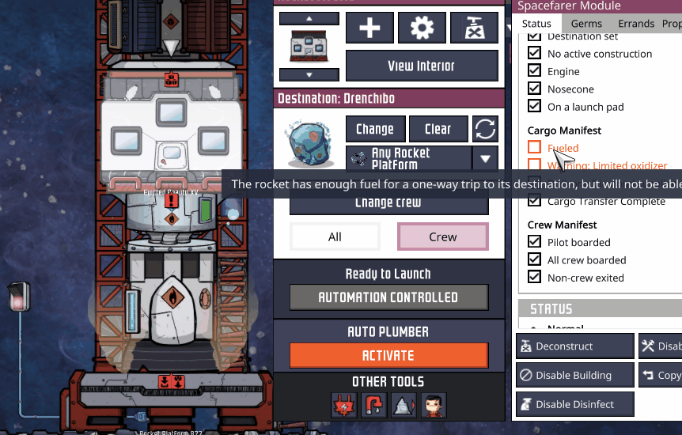

# Just Launch It
Small patch for Oxygen not Included: Spaced Out that allows to launch a rocket **using automation** despite any warnings. 

[**Steam mod link**](https://steamcommunity.com/sharedfiles/filedetails/?id=3020060237)

## tl;dr
I know what I'm doing, let me launch that rockeeet using a switch!

## Long Version
Have you ever found yourself in dire need of automating rocket delivery between two asteroids which are just far enough that your fuel does not suffice for a way back? Surely, you have built refuel station at the destination to mitigate the issue, however, automation refuses to launch despite rocket being perfectly able to get there.

Are you tired of warnings like `Fueled - The rocket has enough fuel for a one-way trip to its destination but will not be able to make it back.` or `Warning: Limited oxidizer - The rocket has enough oxidizer for a one-way trip to its destination but will not be able to make it back.`? While it's possible to launch such rocket manually by clicking ACKNOWLEDGE WARNINGS, automation signal here does nothing.

This patch simply changes automation launch requirements from *Ready* to *Not Failure*, resulting in launching despite any Warnings. (Even Cargo Incomplete)

(Honestly, the documentation for this tweak is like 10 times longer than the code itself :D)